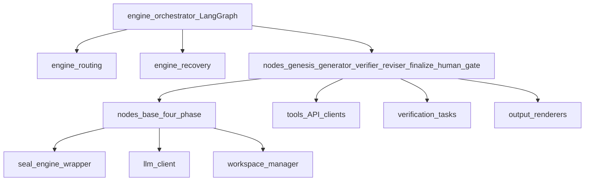

# C4 Level 3 — Major components (`src/antiphoria/`)

**Aligned with:** D-9 §3 (repository structure), D-0 §2.1 (layers), D-5 §4 (four-phase node protocol).

The tree in D-9 is collapsed here into **packages** and **primary runtime edges**. All packages consume **`types/`** (D-2); the diagram omits those edges for clarity.

**Package mapping (D-9 §3)**

| Diagram node | Directory | Spec hooks |
|--------------|-----------|------------|
| `engine_*` | `engine/` | D-0 §7 (LangGraph), §4C, D-2 §8.4, D-5 §10 |
| `nodes_*` | `nodes/` | D-5 §5.x |
| `seal_*` | `seal/` | D-5 §3, §7 |
| `llm_*` | `llm/` | D-0 §4A, D-3, D-5 §6 |
| `tools_*` | `tools/` | D-4 §6 |
| `verification_*` | `verification/` | D-4 §3, §8 |
| `output_*` | `output/` | D-6, D-0 §9 |
| `workspace_*` | `workspace/` | D-2 §13 |

**Notes**

- **Orchestrator** compiles and runs the **LangGraph** for D-0 §2.2; **routing** applies verdict demotion and next-node choice; **recovery** re-verifies the chain before resume (D-5 §10).
- **nodes/base** implements PRE-SEAL → INFERENCE → POST-SEAL → YIELD (D-5 §4; D-0 §2.3).
- **Verifier** uses **tools** and **verification**; **finalize** drives **output** (HAI Card, paper YAML, provenance report).
- **seal** should remain the only path that invokes the external `slop-cli` binary (D-5 §16).

For file-level layout and tests, use D-9 §3 and D-8 directly.
