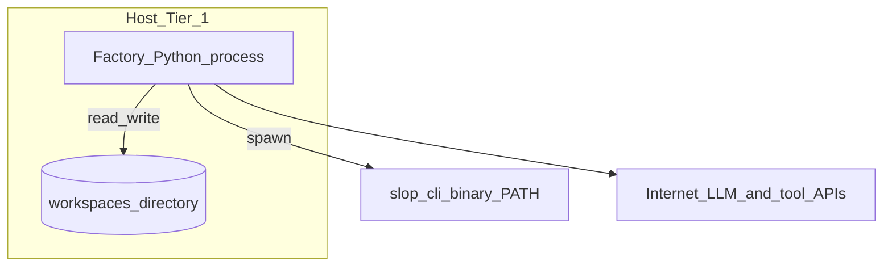
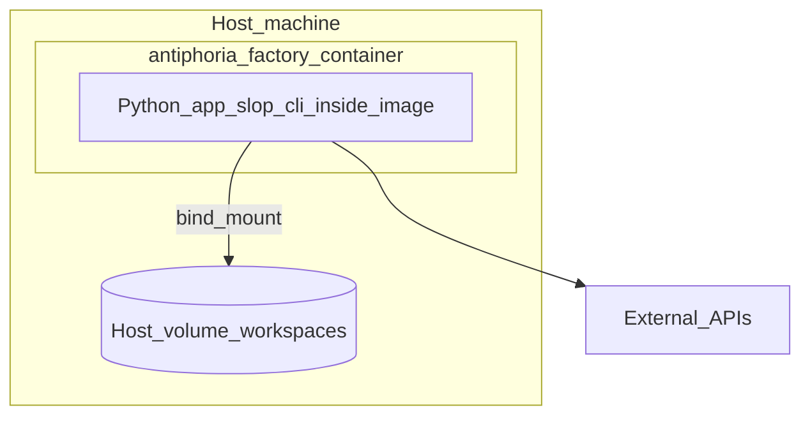
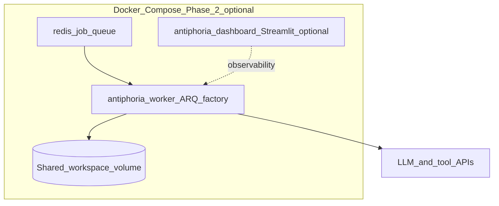

# C4 Level 2 — Containers and deployment

**Aligned with:** D-0 §7 (execution model), §10.1 (Phase 1 vs Phase 2 baseline); D-9 §2 (deployment tiers), §9 (Docker Compose).

## Tier 1 — single Python process (default)

Phase 1: one **factory process** (**LangGraph** orchestrator, nodes, LLM client, seal wrapper), **workspace** on local disk, and **slop-cli** as a separate binary on the host invoked by the factory. No Redis or queue required (D-9 §2, D-0 §10.1).

## Tier 2 — Docker (Phase 1 shape)

Single **application container** plus a **host-mounted volume** for workspaces (D-9 §9.1).

## Tier 2 — optional Phase 2 queue topology

**v0.2+ when justified:** Redis, optional dashboard, **worker** consuming ARQ jobs — still writing workspaces via a shared volume (D-9 §9.1 Phase 2 ASCII).

## Five logical layers (mapping)

D-0 §2.1 stacks **orchestration**, **inference middleware**, **Aletheia loop**, **provenance engine**, and **output artifacts** inside the **Factory Python process** boundary above; **slop-cli** realizes Layer 4’s cryptographic operations at process boundary. See [c4-components.md](c4-components.md) for package-level breakdown.
