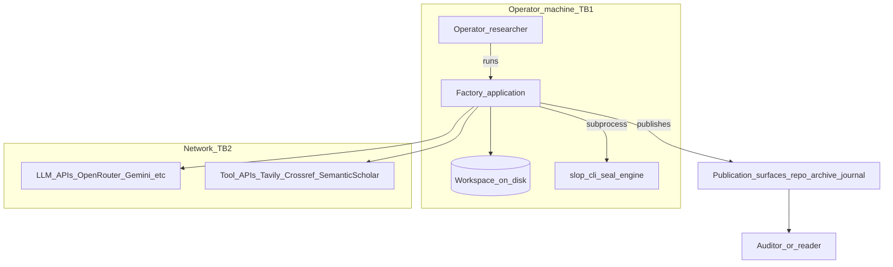

# C4 Level 1 — System context

**Aligned with:** D-0 §2 (architecture overview), D-1 §4 (trust boundaries TB1–TB2 scope for operator vs network).

The **Slop Research Factory** runs on infrastructure controlled by the **operator** (researcher or developer). It calls **LLM** and **tool** APIs over the network, writes a **workspace** on disk, and invokes **slop-cli** for sealing. Published artifacts are consumed by an **auditor** or reader outside the operator’s direct control (D-1 TB3–TB4).

**Notes**

- **TB1:** Everything inside `Operator_machine` is under operator control; the chain does not prove LLM authenticity of bytes on disk (D-1 Non-Defense 1).
- **TB2:** TLS protects transport; pinning and provider signing are separate concerns (D-1 §4, §11).
- **TB3–TB4:** The step from operator-controlled storage to `Publication_surfaces` and then to `Auditor_or_reader` matches D-1 trust boundaries 3 and 4; see [trust-boundaries.md](trust-boundaries.md).
