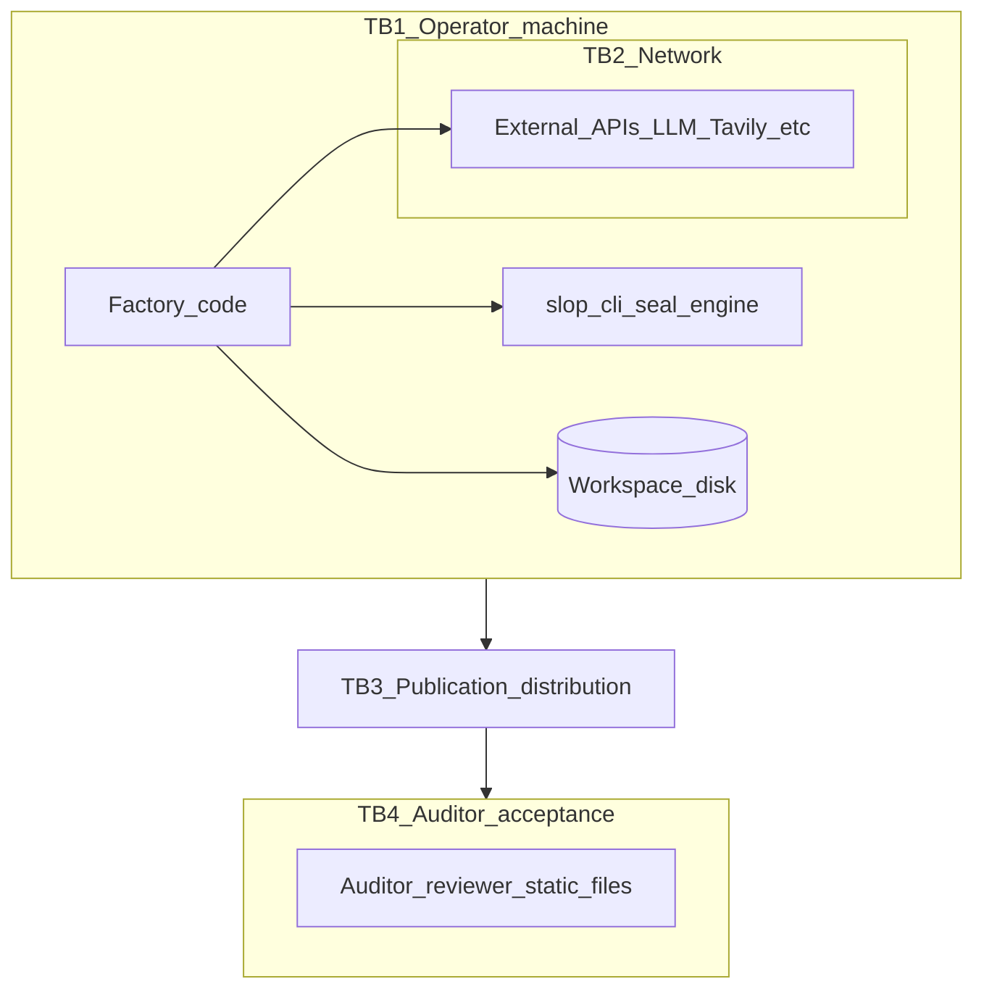

# Trust boundaries TB1–TB4

**Aligned with:** D-1 §4 (full definitions, mitigations, and limitations).

This diagram mirrors the ASCII figure in [glascannon-ai-draft/d1.md](../../glascannon-ai-draft/d1.md) §4. It is a **security / trust** view, not a substitute for [c4-context.md](c4-context.md) (C4 L1).

**Boundary summary**

| ID | Name | Idea |
|----|------|------|
| TB1 | Operator’s machine | Operator controls what is written before sealing. |
| TB2 | Network | API transport; TLS ≠ model-output authenticity. |
| TB3 | Publication / distribution | Artifacts leave operator-controlled storage for repos, archives, etc. |
| TB4 | Auditor acceptance | Reader must trust toolchain honesty without attestation (unless §8/§11-style mitigations exist). |

For TLS MITM, pinning, and provider signing, read D-1 §4 prose (TB2 paragraph and Non-Defense 1 / §11).
